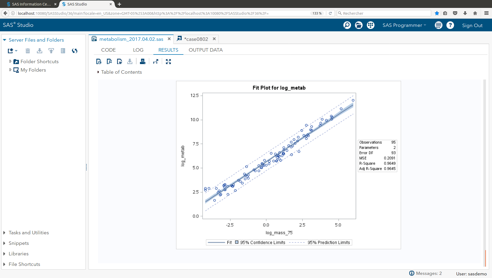
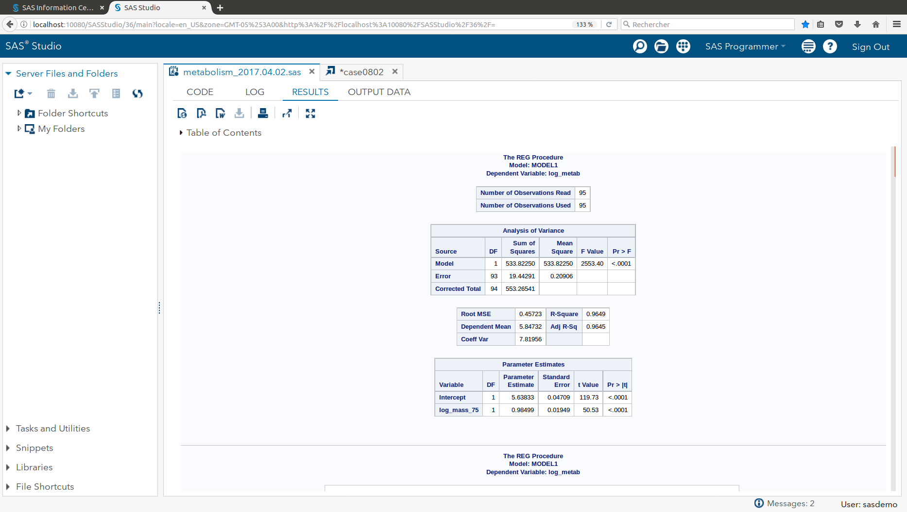
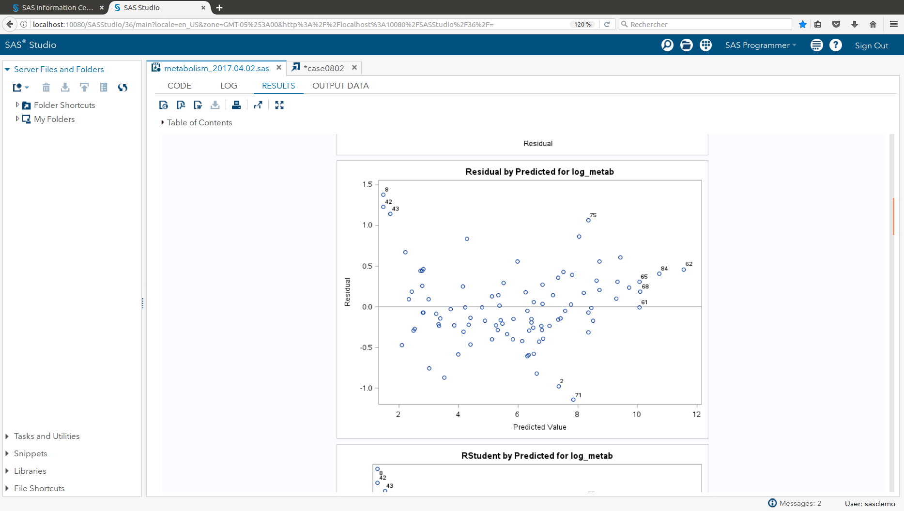
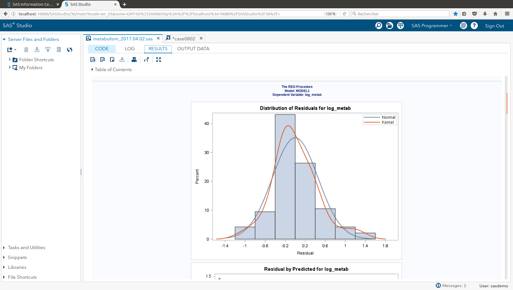

```{r setup, include=FALSE}
knitr::opts_chunk$set(echo = TRUE)
```

## Metabolism - Analysis

The Metabolic data on Canvas has the average mass, metabolic rate and average lifespan of 95 different species of mammals.  Kleiber’s law states that the metabolic rate of an animal species, on average, is proportional to its mass raised to the power of ¾.  Judge the adequacy of this theory with these data.  

```{r metabolism, echo = FALSE}

library(stats)

# ...	read in data

home_dir <- "~/_smu/_src/metabolism/"
setwd(home_dir)
data_dir <- "./data"

setwd(data_dir)

s26 <- read.csv("ex0826.csv", stringsAsFactors = FALSE)

setwd(home_dir)

# ...	add some additional columns for log transforms
x_exp <- 0.75
s26$m34 <- s26$Mass^x_exp
s26$log_mass_75 <- log(s26$m34)
s26$log_metab <- log(s26$Metab)

```


### __Structure of Data Set (with added columns for log transforms)__  

```{r}

str(s26)

```

#### __Add some basic plots for data exploration__  
```{r}
plot(s26$Metab ~ s26$Mass,
	 main = "Metabolic Rates vs. Average Mass of 95 mammal species",
	 xlab = "Mass",
	 ylab = "Metabolic Rate")
```

##### Data set shows very right skewed distribution in both x and y axes as evidenced by the data points in the upper right corner of the plot. In order to reduce the effect of the skewness in the raw data set, the data is transformed to log scale on both x & y axes.  

```{r}
plot(s26$Metab ~ s26$Mass, log = "xy",
	 main = "Metabolic Rates vs. Average Mass of 95 mammal species",
	 xlab = "log(Mass)",
	 ylab = "log(Metabolic Rate)")
```

=-=-=-=-=-=-=-=-=-=-=-=-=-=-=-=-=-=-=-=-=-=-=-=-=-=-=-=-=-=-=-=-=-=-=-=--=-=-=-  
##### Since the base question is to evaluate if the data set is consistent with Kleiber's law, an additional transformation is included to raise the Mass to the 3/4 power. This data plot shows similar apparently normal distributions in both x and y axes, and sufficiently linear to proceed with the regression analysis with the data transformed in this manner.
=-=-=-=-=-=-=-=-=-=-=-=-=-=-=-=-=-=-=-=-=-=-=-=-=-=-=-=-=-=-=-=-=-=-=-=--=-=-=-  

```{r}
plot(s26$Metab ~ s26$m34, log = "xy",
	 main = "Metabolic Rates vs. Average Mass of 95 mammal species",
	 xlab = "log(Mass^3/4)",
	 ylab = "log(Metabolic Rate)")

# ... define data set to analyze 

df_xy <- data.frame(s26$log_mass_75, s26$log_metab)

names(df_xy) <- c("log_mass_75", "log_metab")

str(df_xy)

```

### Homework 11 - Problem Set 1 - Metabolism

=-=-=-=-=-=-=-=-=-=-=-=-=-=-=-=-=-=-=-=-=-=-=-=-=-=-=-=-=-=-=-=-=-=-=-=--=-=-=-  
### __i. A Scatterplot with confidence intervals of the regression line and prediction intervals of the regression line.  Please do in SAS and R!__    
=-=-=-=-=-=-=-=-=-=-=-=-=-=-=-=-=-=-=-=-=-=-=-=-=-=-=-=-=-=-=-=-=-=-=-=--=-=-=-  

```{r, echo = FALSE}


fit_all <- lm(log_metab ~ log_mass_75, data = df_xy)

df_xy_conf_int <- as.data.frame(predict(fit_all, df_xy , interval = "confidence"))

plot(df_xy$log_metab ~ df_xy$log_mass_75, col = 'blue', pch = 19)
polygon(c(df_xy$log_mass_75, rev(df_xy$log_mass_75)),
		c(df_xy_conf_int$lwr, rev(df_xy_conf_int$upr)),col="lightgrey")

lines(fit_all$fitted.values ~ df_xy$log_mass_75, col = 'black', lwd = 4, lty = 3)

lines(df_xy_conf_int$lwr ~ df_xy$log_mass_75, col = 'black', lwd = 1)
lines(df_xy_conf_int$upr ~ df_xy$log_mass_75, col = 'black', lwd = 1)

points(df_xy$log_metab ~ df_xy$log_mass_75, col = 'blue', pch = 19)

df_xy_pred_int <- as.data.frame(predict(fit_all, df_xy, interval = "predict"))

lines(df_xy_pred_int$lwr ~ df_xy$log_mass_75, col = 'grey', lwd = 1, lty = 2)
lines(df_xy_pred_int$upr ~ df_xy$log_mass_75, col = 'grey', lwd = 1, lty = 2)

```

And the SAS plot ...

  


=-=-=-=-=-=-=-=-=-=-=-=-=-=-=-=-=-=-=-=-=-=-=-=-=-=-=-=-=-=-=-=-=-=-=-=--=-=-=-  
### __ii. A table showing the t-statistics and pvalues for the significance of the regression parameters: .   Please do in SAS and R!__  
=-=-=-=-=-=-=-=-=-=-=-=-=-=-=-=-=-=-=-=-=-=-=-=-=-=-=-=-=-=-=-=-=-=-=-=--=-=-=-  


```{r plot, echo=FALSE}

summary(fit_all)

```

And the SAS table ...


  


=-=-=-=-=-=-=-=-=-=-=-=-=-=-=-=-=-=-=-=-=-=-=-=-=-=-=-=-=-=-=-=-=-=-=-=--=-=-=-  
__iii. Using the data in ii show all 6 steps of each hypothesis test.__   
=-=-=-=-=-=-=-=-=-=-=-=-=-=-=-=-=-=-=-=-=-=-=-=-=-=-=-=-=-=-=-=-=-=-=-=--=-=-=-  

##### __Six-Step Hypothesis Test - Slope__   

``` {r, echo = FALSE}

alpha <- 0.05
dof <- dim(df_xy)[1] - 2
crit_value <- qt(1 - alpha/2, dim(df_xy)[1] - 2)

t_value <- coef(summary(fit_all))["log_mass_75","t value"]
p_value <- coef(summary(fit_all))["log_mass_75","Pr(>|t|)"]

if (p_value < alpha)
{
	acc_rej <- "Reject Ho"
	is_is_not_1 <- "is"
	is_is_not_2 <- "is not"
	does_does_not <- "does not"
} else {
	acc_rej <- "Do not Reject Ho"
	is_is_not_1 <- "is not"
	is_is_not_2 <- "is"
	does_does_not <- "does"
}

cnf_intrvl <- confint(fit_all, 'log_mass_75', level = 1 - alpha)
cnf_intrvl_lwr <- cnf_intrvl[1,1]
cnf_intrvl_upr <- cnf_intrvl[1,2]

print_cnf_intrvl <- paste0(sprintf("(%9.3f", cnf_intrvl_lwr), sprintf(", %9.3f)", cnf_intrvl_upr))

```

1: Ho : b1 = 0; Ha ; b1 != 0  
2 : Critical Value : t(0.975, df = __`r dof `__) = +/- __`r crit_value`__   
3 : t = `r t_value `    
4 : p_value = `r p_value` < 0.05 ?    
5: `r acc_rej`  
6 : There `r is_is_not_1` sufficient evidence to suggest at the alpha = `r alpha` level of significance (p-value = `r p_value`) that the slope of the regression line that estimates the Metabolic Rate based on the log(Mass^3/4) of the mammals `r is_is_not_2` equal to zero. A `r (1 - alpha)*100`% confidence interval for the slope is `r print_cnf_intrvl`, which is an interval that `r does_does_not` contain the value zero  
  

##### __Six-Step Hypothesis Test - Intercept__   

``` {r, echo = FALSE}

alpha <- 0.05
dof <- dim(df_xy)[1] - 2
crit_value <- qt(1 - alpha/2, dim(df_xy)[1] - 2)

t_value <- coef(summary(fit_all))["(Intercept)","t value"]
p_value <- coef(summary(fit_all))["(Intercept)","Pr(>|t|)"]

if (p_value < alpha)
{
	acc_rej <- "Reject Ho"
	is_is_not_1 <- "is"
	is_is_not_2 <- "is not"
	does_does_not <- "does not"
} else {
	acc_rej <- "Do not Reject Ho"
	is_is_not_1 <- "is not"
	is_is_not_2 <- "is"
	does_does_not <- "does"
}

cnf_intrvl <- confint(fit_all, '(Intercept)', level = 1 - alpha)
cnf_intrvl_lwr <- cnf_intrvl[1,1]
cnf_intrvl_upr <- cnf_intrvl[1,2]

print_cnf_intrvl <- paste0(sprintf("(%9.3f", cnf_intrvl_lwr), sprintf(", %9.3f)", cnf_intrvl_upr))

```

1 : Ho : b0 = 0; Ha ; b0 != 0  
2 : Critical Value : t(0.975, df = __`r dof `__) = +/- __`r crit_value`__   
3 : t = `r t_value `    
4 : p_value = `r p_value` < 0.05 ?    
5: `r acc_rej`  
6 : There `r is_is_not_1` sufficient evidence to suggest at the alpha = `r alpha` level of significance (p-value = `r p_value`) that the intercept of the regression line that estimates the Metabolic Ratebased on the log(Mass^3/4) of the mammals `r is_is_not_2` equal to zero. A `r (1 - alpha)*100`% confidence interval for the slope is `r print_cnf_intrvl`, which is an interval that `r does_does_not` contain the value zero  


=-=-=-=-=-=-=-=-=-=-=-=-=-=-=-=-=-=-=-=-=-=-=-=-=-=-=-=-=-=-=-=-=-=-=-=--=-=-=-  
### __iv. The regression equation.__    
=-=-=-=-=-=-=-=-=-=-=-=-=-=-=-=-=-=-=-=-=-=-=-=-=-=-=-=-=-=-=-=-=-=-=-=--=-=-=-  

``` {r, echo = FALSE}

b0 <- fit_all$coefficients[1]
b1 <- fit_all$coefficients[2]

```

The Regression equation : 
* log_metab = `r b1` * log_mass_75 + `r b0`


=-=-=-=-=-=-=-=-=-=-=-=-=-=-=-=-=-=-=-=-=-=-=-=-=-=-=-=-=-=-=-=-=-=-=-=--=-=-=-  
### __v. Interpretation of the slope and intercept in the model (regression equation.)__   
=-=-=-=-=-=-=-=-=-=-=-=-=-=-=-=-=-=-=-=-=-=-=-=-=-=-=-=-=-=-=-=-=-=-=-=--=-=-=-  

##### The slope represents the rate of change in log_metab estimated for a unit change in stone log_mass_75 transported by this populations of birds sampled. I.e., for each increase in 1 gram of stone log_mass_75 there is a corresponding increase in log_metab count of `r b1` 

log - log transformation  

y' = ln y  
x' = ln x^z, z = 3/4  

ln y = bo + b1 * x  
y = exp(b0) * exp(ln(x^z))^b1  
y = exp(b0) * (x^z)^b1  
y = exp(b0) * x^(z * b1)  

In this case :  
b0 = `r b0`  
b1 = `r b1`  
Therefore, the relationship can be expressed as :  
Metabolic Rate = `r exp(b0)` * x ^ (`r x_exp * b1`)  
  
  
 #### __To interpret the meaning of the slope in different terms, for every doubling of the mass of the mammal species, the associated increase in metabolic rate = 2 ^ `r x_exp * b1`, or in other words, `r 2^(x_exp * b1)`__  
  
#### __To interpret the meaning of the intercept in different terms, at the base level for a small species, e.g., mass = 1, the base metabolic rate for all species is expected at a level of `r exp(b0)`__  


#### __The intercept represents the estimated average level of log_metab counts associated to a transported stone log_mass_75 of 0 grams by this population of birds. From a practical point of view, since each bird evalauted did actually transport stones of some log_mass_75, the intercept provides an estimate of the lower bound of log_metab counts in this population of birds.__  


=-=-=-=-=-=-=-=-=-=-=-=-=-=-=-=-=-=-=-=-=-=-=-=-=-=-=-=-=-=-=-=-=-=-=-=--=-=-=-  
__x. A scatterplot of residuals.    Please do in SAS and R__  
=-=-=-=-=-=-=-=-=-=-=-=-=-=-=-=-=-=-=-=-=-=-=-=-=-=-=-=-=-=-=-=-=-=-=-=--=-=-=-  


``` {r, echo = FALSE}

log_metab_res = resid(fit_all)

plot(df_xy$log_mass_75, log_metab_res, 
     pch = 19,
	 col = "blue",
	 ylab="Residuals",
	 xlab="Stone log_mass_75", 
     main="Metabolism - Residual Plot") 
abline(0, 0)

```


=-=-=-=-=-=-=-=-=-=-=-=-=-=-=-=-=-=-=-=-=-=-=-=-=-=-=-=-=-=-=-=-=-=-=-=--=-=-=-  
### __xi. A histogram of residuals with normal distribution superimposed__    
=-=-=-=-=-=-=-=-=-=-=-=-=-=-=-=-=-=-=-=-=-=-=-=-=-=-=-=-=-=-=-=-=-=-=-=--=-=-=-  

``` {r, echo = FALSE}

res_mean <- mean(log_metab_res)
res_std <- sqrt(var(log_metab_res))

hist(log_metab_res, density=20, breaks = 10, prob = TRUE, 
     xlab="Stone log_mass_75",
#	 ylim=c(0, 10), 
     main="Metabolism - Residuals")
curve(dnorm(x, mean = res_mean, sd = res_std),
	  col = "darkblue",
	  lwd = 2,
	  add = TRUE,
	  yaxt = "n")

```

And the SAS plots ...





=-=-=-=-=-=-=-=-=-=-=-=-=-=-=-=-=-=-=-=-=-=-=-=-=-=-=-=-=-=-=-=-=-=-=-=--=-=-=-  

### __xii. Provide a measure of the amount of variation in the response that is accounted for by the explanatory variable.  Interpret this measure clearly indicating the units of the response and the explanatory variables.__  
=-=-=-=-=-=-=-=-=-=-=-=-=-=-=-=-=-=-=-=-=-=-=-=-=-=-=-=-=-=-=-=-=-=-=-=--=-=-=-  


```{r}
r2 <- summary.lm(fit_all, r.squared=TRUE)$r.squared
r2_format <- sprintf("%8.2f %%", r2*100)
non_r2_format <- sprintf("%8.2f %%", (1.0 - r2)*100)
```

#### R-squared value for model = `r r2`

#### Therefore, `r r2_format` of the variation observed in the dependent variable (log(Metabolism) is explained by the log(mass^3/4) independent variable, leaving only `r non_r2_format` variation that is available to be explained by any remaining contributory factors.
